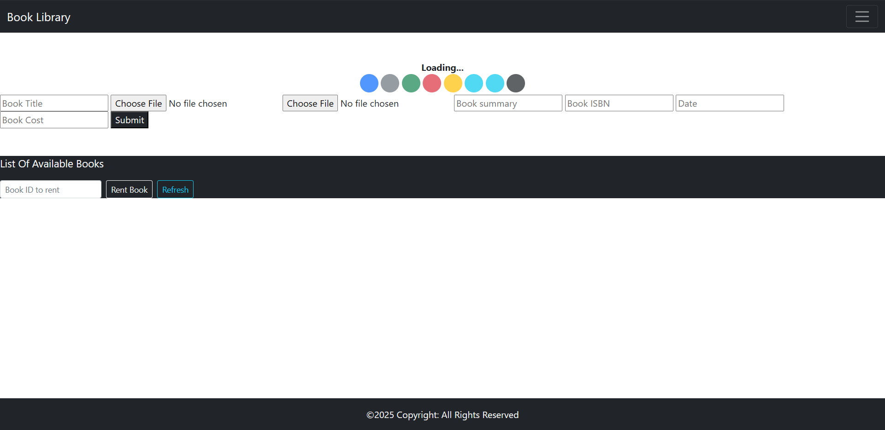

# Book Library Dapp

Book Library is a decentralized application that helps maintain records of books with their metadata (title, cover image, ISBN, date, summary, and IPFS-hosted file).

implementation to use the Petra Aptos Wallet extension (Devnet). On load, the dApp attempts to connect to the Petra wallet via `window.aptos` and will use your Aptos account to (eventually) submit transactions. Smart contract interaction for Aptos is currently scaffolded (TODO markers) and IPFS storage for book assets remains intact.

## Current Status

* Petra wallet connection logic added (`connectPetraWallet`).
* Book add / rent transaction calls are placeholders awaiting Aptos Move contract + transaction payload definitions.
* Frontend build pipeline unchanged (Webpack 4 legacy setup outputting to `docs/`).

## Preview



## Prerequisites

* Node.js 16.x LTS recommended (Webpack 4 + OpenSSL legacy compatibility). If using Node 17+ you may need the `--openssl-legacy-provider` flag.
* Petra Aptos Wallet browser extension: <https://petra.app/>
* (Optional) Aptos CLI + a deployed Move module for full backend functionality.

## Usage (Petra / Aptos Devnet)

1. Install the Petra wallet extension.
2. Create or import a Devnet account (your devnet address can be funded via the Aptos Devnet faucet: <https://aptos.dev/faucet> ).
3. Open the dApp in the browser (development instructions below) and approve the connection prompt.
4. Add a book (UI will upload image + document to IPFS; transaction submission is a placeholder until Move module integration is completed).

## TODO for Full Aptos Integration

* Implement a Move module (e.g. `BookLibrary.move`) with resources / entry functions:
  * `add_book(title: string, isbn: string, date: string, summary: string, uri: string, cover_uri: string, cost: u64)`
  * `rent_book(id: u64)` (or analogous logic)
  * `get_books` view pattern via account resource or table iteration
* Expose REST / SDK queries to replace the removed Web3 contract calls.
* Replace placeholders in `src/main.js` where `// TODO:` comments appear.
* Add type-safe helpers for building Aptos transactions (payload construction + signing with `window.aptos.signAndSubmitTransaction`).

## Move Contract

The on-chain logic is implemented in `move/BookLibrary`:

* `Move.toml` defines the package and the `book_library` address bound to: `0xe8bbda11f2562947e4518f58dbacdf4df1dd2c192157de8c190495b30660584b`.
* `sources/BookLibrary.move` contains:
  * `Library` resource storing a dynamic vector of `Book` structs.
  * Entry functions: `init`, `add_book`, `rent_book`.
  * Helper getter: `get_books` (returns a copy of stored vector for read APIs).

### Build & Publish (Aptos Devnet)

Install / update the Aptos CLI first: <https://aptos.dev/cli-tools/aptos-cli-tool/install-aptos-cli>

Initialize (only once, if you have not already):

```powershell
aptos init --profile booklib --rest-url https://fullnode.devnet.aptoslabs.com --faucet-url https://faucet.devnet.aptoslabs.com
```

Fund (if needed):

```powershell
aptos account fund-with-faucet --account 0xe8bbda11f2562947e4518f58dbacdf4df1dd2c192157de8c190495b30660584b --amount 10000
```

Publish the module (from `move/BookLibrary` directory):

```powershell
aptos move compile --named-addresses book_library=0xe8bbda11f2562947e4518f58dbacdf4df1dd2c192157de8c190495b30660584b
aptos move publish  --named-addresses book_library=0xe8bbda11f2562947e4518f58dbacdf4df1dd2c192157de8c190495b30660584b
```

After publishing, view the module on the explorer:

<https://explorer.aptoslabs.com/account/0xe8bbda11f2562947e4518f58dbacdf4df1dd2c192157de8c190495b30660584b/modules?network=devnet>

You can also query books via a view request (when a view is added) or by reading the account resource (currently requires full vector copy).

### Frontend Integration Roadmap

1. Replace placeholder add/rent code with `signAndSubmitTransaction` payloads referencing entry functions:
   * Module name: `book_library::book_library`.
   * Function: `add_book` / `rent_book`.
2. Use the Aptos REST API to poll transaction status: `GET /transactions/by_hash/{hash}`.
3. Implement a lightweight caching layer for book metadata (thumbnail preview, etc.).
4. Optimize IPFS retrieval with a public gateway fallback list.

---

## Development Guide

Below is the list of available scripts for developments;

### Install

```bash
npm install
```

*Installs required node packages.*

### Development

```bash
npm run dev
```

Starts a webpack-dev-server on port 4000 (see `index.js`).
Open: <http://localhost:4000>

If you encounter OpenSSL provider errors on newer Node versions:

```powershell
$env:NODE_OPTIONS="--openssl-legacy-provider"; npm run dev
```

### Build and Start

```bash
npm run build
```

Builds the production bundle into the `docs/` directory (used for static hosting).

> The below command requires the [servez](https://www.npmjs.com/package/servez) node package. Install globally with: ```npm install servez -g```

```bash
npm run start
```

Runs the Node script defined in `index.js` (webpack dev server wrapper). Not a static `serve` of the built `docs/` directory—use a static host (GitHub Pages, Netlify, Vercel) for the contents of `docs/` after `npm run build`.

To preview the production bundle locally after building you can install `serve` or `servez` globally:

```bash
npm install -g servez
servez docs
```

Then open the printed local URL (often <http://localhost:8080> or <http://127.0.0.1:8080> depending on tool output).

